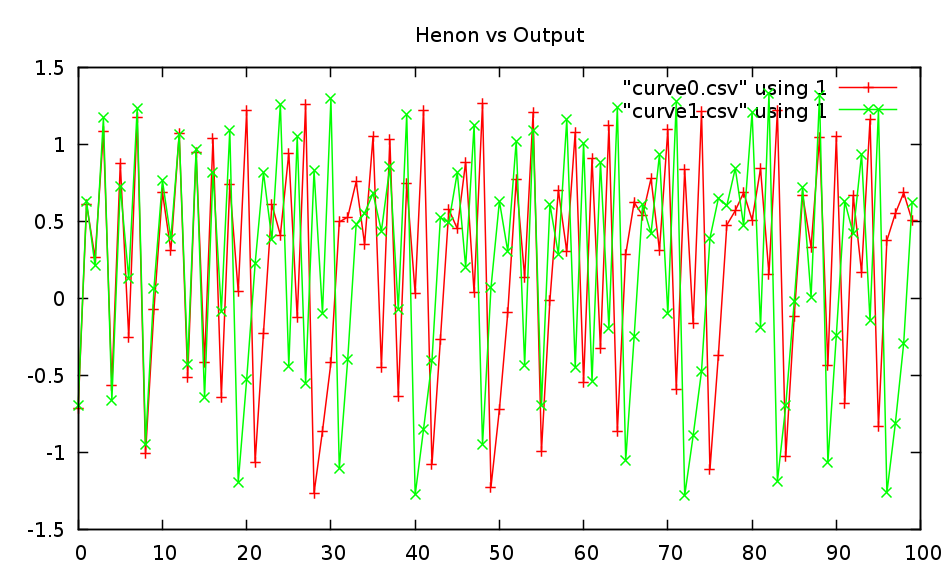
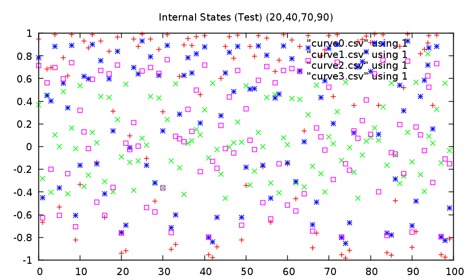

Lambda Neural Networks
===

This is an implementation of echo state neural networks based on the report [The "echo state" approach to analyzing and training recurrent neural networks](http://minds.jacobs-university.de/sites/default/files/uploads/papers/EchoStatesTechRep.pdf) by Herbert Jaeger. The purpose of this library is to provide a framework to create, train and run echo state neural networks with time series. This implementation allows networks of various dimensions to be created. It allows the networks to be trained and run with or without noise. The networks can be trained and run by teacher forcing an output signal if desired.

This library is being implemented as part of the work for my bachelor's thesis titled "Classification of Human Motion using Echo State Neural Networks". The [research proposal](https://github.com/netogallo/LambdaNN/blob/master/Research%20Proposal.pdf?raw=true) contains detailed information about the work being done.

# Examples

## The Henon Attractor

The examples folder contains a file for learning the Henon time series. By default the file uses a neural network with the following parameters:

 * 100 internal nodes
 * Spectral radius of the internal weights matrix: 1.15
 * Connectivity of the internal weights matrix: 0.3
 * No input weights
 * Range of the output feedback weights: (-2,2)
 * Connectivity of the output feedback weights matrix: 0.8
 * Tradeoff parameter for the Ridge Regression: 2.4

Following are the generated plots of one of such examples:

## Motion Capture

An Echo State Network was trained to learn human movements. The script used to learn this movement can be found. The network parameters used are the following:

 * Network size: 100 Nodes
 * Network output size: 28 outputs
 * Internal Matrix Connectivity: 0.3
 * Internal Matrix Spectral Radius: 1.15
 * No input weights
 * Range of Output Feedback Weights: (-1/4,1/4)
 * Regularization Parameter for the Ridge Regression: 0.15
 * Leaky Ingegrator of 1/5

Walking is a periodic movement well suited for this type of networks. Normally, a network of 100 units would not be capable of learning to simulate walking since the period is too big for such a network. To address this problem, a leaky integrator was used. The leaky integrator has the property of slowing the network down so it can learn periodic motions with bigger periods without needing additional units. 

We can observe that the network state evolves in a nice and periodic way. Also it is stable so the walk can continue without transforming into chaos. Following is a video of the walk exported to motion capture data:

