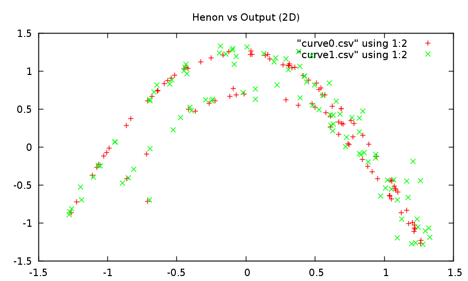

Lambda Neural Networks
===

This is an implementation of echo state neural networks based on the report [The "echo state" approach to analyzing and training recurrent neural networks](http://minds.jacobs-university.de/sites/default/files/uploads/papers/EchoStatesTechRep.pdf) by Herbert Jaeger. The purpose of this library is to provide a framework to create, train and run echo state neural networks with time series. This implementation allows networks of various dimensions to be created. It allows the networks to be trained and run with or without noise. The networks can be trained and run by teacher forcing an output signal if desired.

This library is being implemented as part of the work for my bachelor's thesis titled "Classification of Human Motion using Echo State Neural Networks". The [research proposal](https://github.com/netogallo/LambdaNN/blob/master/Research%20Proposal.pdf?raw=true) contains detailed information about the work being done.

# Examples

The examples folder contains a file for learning the Henon time series. By default the file uses a neural network with the following parameters:

 * 100 internal nodes
 * Spectral radius of the internal weights matrix: 1.15
 * Connectivity of the internal weights matrix: 0.3
 * No input weights
 * Range of the output feedback weights: (-2,2)
 * Connectivity of the output feedback weights matrix: 0.8
 * Tradeoff parameter for the Ridge Regression: 2.4

Following are the generated plots of one of such examples:

